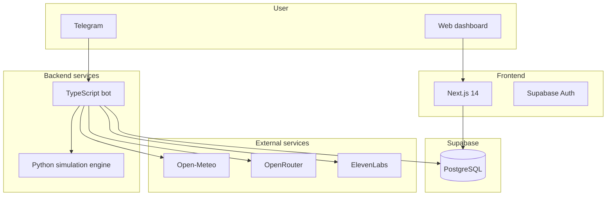

# ALLO

**Adaptive Landslide Learning Observatory**  
*Stochastic and agentic monitoring for climate-related landslide risk.*

ALLO is a research-oriented observatory and decision-support system for climate-related landslide risk
in Andean hillslopes. Its purpose is to estimate, with explicit uncertainty, the probability that a
hillslope unit exceeds critical soil-saturation conditions under observed and forecast rainfall, and to
translate that signal into auditable alert levels for monitoring and operational response.

ALLO is **not** a deterministic landslide predictor. It does not claim to predict the exact time,
location, or occurrence of an individual landslide. The scientific ground truth for that framing lives
in [docs/MODEL_CARD.md](docs/MODEL_CARD.md) and the verified data catalog lives in [docs/DATA_SOURCES.md](docs/DATA_SOURCES.md).

## Product posture

- Adaptive observatory for rainfall-driven hillslope monitoring
- Stochastic simulation and agentic interpretation for decision support
- Research prototype grounded in explicit limits, uncertainty, and data provenance

For design alignment and identity notes, see [docs/allo-brand-audit.md](docs/allo-brand-audit.md).

## Current system shape



## Scientific framing

ALLO currently operationalizes a stochastic monitoring workflow around a latent soil-saturation state,
real rainfall forcing, Monte Carlo propagation, and alert communication. The governing framing is:

- monitor saturation-related hazard conditions rather than predict individual failures
- preserve uncertainty explicitly rather than collapse outputs into deterministic claims
- support human judgment with auditable alert bands and traceable data inputs

The long-form scientific scope, exclusions, invariants, and model tiers are defined in
[docs/MODEL_CARD.md](docs/MODEL_CARD.md).

## Repository structure

- `src/` TypeScript bot service with domain, application, infrastructure, and Telegram interfaces
- `eco-stochast-poc/python_engine/` Python simulation microservice
- `web/` Next.js dashboard and onboarding flow
- `docs/` model card, data sources, brand audit, and audit notes

## Local setup

```bash
cp .env.example .env
docker-compose up -d
npm install
npm run dev
cd web
npm install
npm run dev
```

## Validation commands

```bash
npm test
npm run build
cd web && npm run build
```

## Notes

- The local implementation still contains legacy stochastic engine components while the canonical
  scientific framing is defined in the ALLO model card.
- External data and deployment claims should be checked against `docs/DATA_SOURCES.md` before being
  surfaced in product copy or code.
