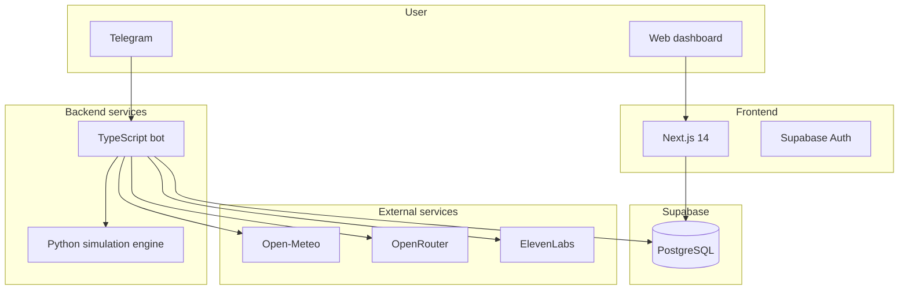

# ALLO

[](LICENSE)

**Adaptive Landslide Learning Observatory**  
*Stochastic and agentic monitoring for climate-related landslide risk.*

ALLO is a research-oriented observatory and decision-support system for climate-related landslide risk
in Andean hillslopes. Its purpose is to estimate, with explicit uncertainty, the probability that a
hillslope unit exceeds critical soil-saturation conditions under observed and forecast rainfall, and to
translate that signal into auditable alert levels for monitoring and operational response.

ALLO is **not** a deterministic landslide predictor. It does not claim to predict the exact time,
location, or occurrence of an individual landslide. The scientific ground truth for that framing lives
in [docs/MODEL_CARD.md](docs/MODEL_CARD.md) and the verified data catalog lives in [docs/DATA_SOURCES.md](docs/DATA_SOURCES.md).

## Product posture

- Adaptive observatory for rainfall-driven hillslope monitoring
- Stochastic simulation and agentic interpretation for decision support
- Research prototype grounded in explicit limits, uncertainty, and data provenance

For design alignment and identity notes, see [docs/allo-brand-audit.md](docs/allo-brand-audit.md).

## Current system shape



## Scientific framing

ALLO currently operationalizes a stochastic monitoring workflow around a latent soil-saturation state,
real rainfall forcing, Monte Carlo propagation, and alert communication. The governing framing is:

- monitor saturation-related hazard conditions rather than predict individual failures
- preserve uncertainty explicitly rather than collapse outputs into deterministic claims
- support human judgment with auditable alert bands and traceable data inputs

The long-form scientific scope, exclusions, invariants, and model tiers are defined in
[docs/MODEL_CARD.md](docs/MODEL_CARD.md).

## Repository structure

- `src/` TypeScript bot service with domain, application, infrastructure, and Telegram interfaces
- `eco-stochast-poc/python_engine/` Python simulation microservice
- `web/` Next.js dashboard and onboarding flow
- `docs/` model card, data sources, brand audit, and audit notes

## Requirements

| Component | Version | Notes |
|---|---|---|
| Node.js | 20 LTS or 22 (`.nvmrc` pins 20) | `better-sqlite3` 11 ships no prebuilt binary for newer majors and fails to compile on Node 26, so `npm install` breaks there. |
| Python | 3.11+ | Simulation service only; dependencies in `eco-stochast-poc/python_engine/requirements.txt`. |
| Docker + Compose | any recent | Optional; runs the Python service and the bot together. |

What needs credentials, and what does not:

| Capability | Credential | Without it |
|---|---|---|
| Test suites (`npm test`, Python `unittest`) | none | Run fully offline; external services are mocked. |
| Python simulation service | none | Runs standalone: `uvicorn main:app` exposes `/simulate_risk` and `/health`. |
| Weather (Open-Meteo) | none | Public API, no key. |
| Telegram bot | `TELEGRAM_BOT_TOKEN` | The bot process does not start. |
| LLM explanations (OpenRouter) | `OPENROUTER_API_KEY` | The bot process does not start. |
| Voice alerts (ElevenLabs) | `ELEVENLABS_API_KEY` | The bot process does not start (the key is validated at boot even if voice is never used). |
| Session store (Supabase) | `SUPABASE_*` | Optional: falls back to a local SQLite file (`DB_PATH`). |
| Web dashboard | `NEXT_PUBLIC_SUPABASE_*` | The public `/demo` page works; authenticated pages do not. |

All variables are listed, with placeholder values only, in [.env.example](.env.example).

## Local setup

```bash
cp .env.example .env
docker-compose up -d
npm install
npm run dev
cd web
npm install
npm run dev
```

## Validation commands

```bash
npm test
npm run build
cd web && npm run build
```

## Notes

- The local implementation still contains legacy stochastic engine components while the canonical
  scientific framing is defined in the ALLO model card.
- External data and deployment claims should be checked against `docs/DATA_SOURCES.md` before being
  surfaced in product copy or code.

## How to cite

Citation metadata lives in [CITATION.cff](CITATION.cff); GitHub renders it under "Cite this
repository" in the sidebar, in APA and BibTeX. Until the archived release has a DOI, cite the
repository itself:

> Orrego Franco, C. M., Castañeda Cardona, M., & Riaño-Rojas, J. C. (2026). *ALLO: Adaptive
> Landslide Learning Observatory* (Version 1.0.0) [Computer software].
> https://github.com/The-Velveteen-Project/EcoAgent

## License

Copyright 2026 Universidad Nacional de Colombia, Sede Manizales.

ALLO is released under the [Apache License, Version 2.0](LICENSE); see [NOTICE](NOTICE) for the
copyright statement. You may use, modify and redistribute the code under the terms of that license,
which includes an explicit patent grant. The software is provided "as is", without warranty of any
kind: ALLO is a research prototype for decision support, not a certified warning service, and its
outputs must not be the sole basis for an evacuation or civil-protection decision.

Third-party services that ALLO calls (Open-Meteo, OpenRouter, ElevenLabs, Supabase) and the datasets
listed in [docs/DATA_SOURCES.md](docs/DATA_SOURCES.md) are governed by their own terms, not by this
license.
