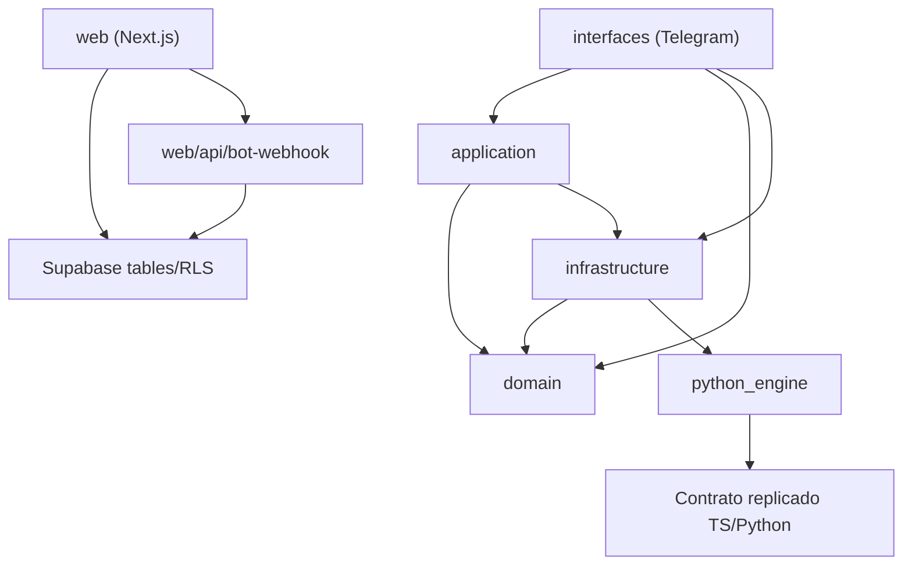

# ALLO Audit Map

## Alcance

Repositorio auditado completo, excluyendo `node_modules`, `.git`, `dist` y `.next`.

Árbol funcional identificado:

- Backend TypeScript por capas en `src/`
- Motor numérico Python en `eco-stochast-poc/python_engine/`
- Frontend Next.js en `web/`
- Infra y despliegue en `Dockerfile`, `docker-compose.yml`, `.env.example`
- Documentación existente en `README.md`, `docs/allo-brand-audit.md`, `docs/MODEL_CARD.md` y `docs/DATA_SOURCES.md`

## 1. Mapa de módulos y responsabilidad

### `src/domain`

- `src/domain/ports/ISimulationEngine.ts`
  Define el contrato tipado de entrada/salida del motor CIR y el enum de alertas.
- `src/domain/ports/IWeatherService.ts`
  Define el contrato para clima en tiempo real y fija coordenadas por defecto de Manizales.
- `src/domain/ports/IVoiceService.ts`
  Define el contrato de síntesis de voz con retorno nullable.
- `src/domain/models/UserSession.ts`
  Define sesión, historial y preferencias del usuario, más defaults SaaS.

### `src/application`

- `src/application/RiskAnalysisUseCase.ts`
  Orquesta el flujo principal `settings -> weather -> simulation -> LLM summary -> voice -> persistence`.
- `src/application/ModelExplanationUseCase.ts`
  Genera una explicación narrativa del modelo CIR usando OpenRouter.
- `src/application/prompts/buildSystemPrompt.ts`
  Construye el system prompt del agente conversacional con guardrails anti-alucinación.
- `src/application/tools/agentTools.ts`
  Declara las herramientas disponibles para function calling.

### `src/infrastructure`

- `src/infrastructure/simulation/PythonCIREngine.ts`
  Cliente HTTP al motor FastAPI, con validación Zod y tipificación de errores.
- `src/infrastructure/simulation/LocalCIREngine.ts`
  Implementación local en TypeScript del mismo esquema CIR como fallback.
- `src/infrastructure/simulation/FailoverSimulationEngine.ts`
  Encapsula la política de failover Python -> local.
- `src/infrastructure/simulation/errors.ts`
  Define errores diferenciados de disponibilidad, validación y rate limit.
- `src/infrastructure/weather/OpenMeteoService.ts`
  Implementa consulta meteorológica vía Open-Meteo.
- `src/infrastructure/voice/ElevenLabsService.ts`
  Implementa TTS opcional con degradación a `null`.
- `src/infrastructure/session/SessionRepository.ts`
  Define la interfaz de persistencia de sesión y una implementación SQLite local.
- `src/infrastructure/session/SupabaseSessionRepository.ts`
  Implementa persistencia SaaS sobre `users`, `user_settings` y `risk_reports`.

### `src/interfaces`

- `src/interfaces/telegram/bot.ts`
  Composition de comandos, middleware y handler de texto de Grammy.
- `src/interfaces/telegram/middleware/authMiddleware.ts`
  Resuelve autorización híbrida y carga `ctx.session`.
- `src/interfaces/telegram/handlers/commandHandlers.ts`
  Implementa `/start`, `/clima`, `/configurar`, `/umbral`, `/modelo`, `/ayuda`.
- `src/interfaces/telegram/handlers/textHandler.ts`
  Implementa el loop conversacional con tool calling.

### `src/config` y arranque

- `src/config/settings.ts`
  Valida variables de entorno con Zod.
- `src/config/logger.ts`
  Centraliza logging estructurado.
- `src/index.ts`
  Composition root: compone dependencias y arranca el bot.

### `eco-stochast-poc/python_engine`

- `main.py`
  FastAPI app con `/health` y `/simulate_risk`.
- `models.py`
  Modelos Pydantic de input/output y enum de alertas.
- `config.py`
  Parámetros CIR y límites de simulación.
- `Dockerfile`, `requirements.txt`
  Empaquetado y runtime del servicio numérico.

### `web/app`

- `web/app/page.tsx`
  Landing pública.
- `web/app/(auth)/login/page.tsx`
  Inicio de sesión con Supabase Auth.
- `web/app/(auth)/register/page.tsx`
  Registro y bootstrap de `users` + `user_settings`.
- `web/app/onboarding/page.tsx`
  Vinculación entre cuenta web y Telegram mediante `telegram_chat_id`.
- `web/app/dashboard/layout.tsx`
  Shell autenticado del panel.
- `web/app/dashboard/page.tsx`
  Resumen de riesgo, mapa y serie temporal.
- `web/app/dashboard/history/page.tsx`
  Historial tabular de reportes.
- `web/app/dashboard/settings/page.tsx`
  Ajustes del usuario persistidos en `user_settings`.
- `web/app/api/bot-webhook/route.ts`
  Route handler para inserción de reportes en Supabase vía webhook HTTP.

### `web/lib`

- `web/lib/supabase/client.ts`
  Cliente browser-side.
- `web/lib/supabase/server.ts`
  Cliente server-side con cookies.
- `web/lib/supabase/schema.sql`
  Esquema y políticas RLS.
- `web/lib/i18n/LanguageContext.tsx`
  Estado de idioma y traducciones runtime.
- `web/lib/i18n/translations.ts`
  Diccionario bilingüe de UI.

## 2. Grafo de dependencias entre capas

### Lectura del grafo real

- La dependencia `interfaces -> application` es la dominante en el bot.
- La dependencia `application -> domain` existe y es esperable.
- La dependencia `application -> infrastructure` también existe en código real, porque `RiskAnalysisUseCase` y `ModelExplanationUseCase` importan `ISessionRepository` desde `src/infrastructure/session/SessionRepository.ts`.
- La dependencia `infrastructure -> application` también existe, porque `SessionRepository.ts` y `SupabaseSessionRepository.ts` importan `RiskReport` desde `src/application/RiskAnalysisUseCase.ts`.
- `web` consume Supabase directamente; no consume casos de uso del backend.
- `python_engine` no comparte código con TypeScript; comparte contrato y lógica por duplicación manual.

## 3. Rutas críticas de ejecución

### 3.1 Flujo de análisis de riesgo

1. `src/index.ts:43-58` instancia `PythonCIREngine`, `LocalCIREngine`, `FailoverSimulationEngine`, `OpenMeteoService`, `ElevenLabsService` y `SupabaseSessionRepository`.
2. `src/index.ts:67-78` crea `RiskAnalysisUseCase` y `ModelExplanationUseCase`.
3. `src/interfaces/telegram/bot.ts:55-60` registra `/clima`.
4. `src/interfaces/telegram/handlers/commandHandlers.ts:46-88` ejecuta `riskAnalysis.analyzeRisk(chatId)`.
5. `src/application/RiskAnalysisUseCase.ts:60-92` carga settings, consulta clima y corre simulación.
6. `src/application/RiskAnalysisUseCase.ts:98-123` genera resumen LLM.
7. `src/application/RiskAnalysisUseCase.ts:131-137` genera audio solo para `HIGH/CRITICAL` si voz habilitada.
8. `src/application/RiskAnalysisUseCase.ts:141-165` persiste mensaje y `risk_report` vía repositorio.
9. `src/infrastructure/simulation/PythonCIREngine.ts:38-66` llama `POST /simulate_risk`; si falla, `src/infrastructure/simulation/FailoverSimulationEngine.ts:27-41` deriva a `LocalCIREngine`.
10. `eco-stochast-poc/python_engine/main.py:40-122` ejecuta la simulación Monte Carlo CIR.

### 3.2 Flujo del bot Telegram

1. `src/index.ts:81-102` crea y arranca Grammy.
2. `src/interfaces/telegram/bot.ts:52` aplica `createAuthMiddleware`.
3. `src/interfaces/telegram/middleware/authMiddleware.ts:40-84` decide si el mensaje entra por comando público, whitelist o cuenta vinculada.
4. Comandos:
   - `/start` en `src/interfaces/telegram/handlers/commandHandlers.ts:25-42`
   - `/clima` en `src/interfaces/telegram/handlers/commandHandlers.ts:46-88`
   - `/modelo` en `src/interfaces/telegram/handlers/commandHandlers.ts:144-163`
5. Texto libre:
   - `src/interfaces/telegram/bot.ts:63-69` conecta `handleText`
   - `src/interfaces/telegram/handlers/textHandler.ts:40-149` construye prompt, ejecuta herramientas y persiste la conversación.

### 3.3 Flujo del webhook web

1. `web/app/api/bot-webhook/route.ts:30-71` recibe JSON con `telegram_chat_id` y métricas.
2. `web/app/api/bot-webhook/route.ts:37-48` resuelve `user.id` a partir de `users.telegram_chat_id`.
3. `web/app/api/bot-webhook/route.ts:51-65` inserta en `risk_reports`.

### Observación estructural sobre el webhook

- Esta ruta existe y persiste reportes.
- En el código auditado no hay ningún emisor HTTP hacia `web/app/api/bot-webhook/route.ts`.
- El backend real guarda reportes directamente en Supabase mediante `src/infrastructure/session/SupabaseSessionRepository.ts:152-175`.
- Por lo tanto, el “webhook web” es una ruta crítica potencial, no una ruta crítica actualmente conectada.

## 4. Lógica de modelo duplicada entre Python y TypeScript

Duplicación explícita del modelo CIR entre `eco-stochast-poc/python_engine/main.py` y `src/infrastructure/simulation/LocalCIREngine.ts`.

### Duplicaciones de lógica numérica

- Parámetros base:
  - Python `main.py:56-57`
  - TypeScript `LocalCIREngine.ts:20-21`
- Media de largo plazo `b = 0.4`:
  - Python `main.py:60`
  - TypeScript `LocalCIREngine.ts:23`
- Ajuste por precipitación `+ precipitation * 0.05`:
  - Python `main.py:61`
  - TypeScript `LocalCIREngine.ts:24`
- Ajuste por humedad `+ (humidity/100) * 0.2`:
  - Python `main.py:62`
  - TypeScript `LocalCIREngine.ts:25`
- Factor de evaporación por temperatura:
  - Python `main.py:65-66`
  - TypeScript `LocalCIREngine.ts:27-28`
- Ajuste de volatilidad `sigma * (1 + precipitation / 20)`:
  - Python `main.py:69`
  - TypeScript `LocalCIREngine.ts:30`
- Horizonte `time_horizon_hours / 24`, `N=100`:
  - Python `main.py:72-74`
  - TypeScript `LocalCIREngine.ts:32-34`
- Umbral crítico `0.6`:
  - Python `main.py:98`
  - TypeScript `LocalCIREngine.ts:35`
- Clasificación de alertas `>0.7 / >0.4 / >0.15`:
  - Python `main.py:102-109`
  - TypeScript `LocalCIREngine.ts:64-68`

### Duplicaciones de contrato

- Enum de alertas:
  - Python `models.py:17-22`
  - TypeScript `src/domain/ports/ISimulationEngine.ts:32-33`
- Input contract:
  - Python `models.py:25-63`
  - TypeScript `src/domain/ports/ISimulationEngine.ts:12-27`
- Output contract:
  - Python `models.py:67-88`
  - TypeScript `src/domain/ports/ISimulationEngine.ts:35-47`

### Duplicaciones narrativas del modelo

- La explicación textual del modelo también está replicada en prompts separados:
  - `src/application/ModelExplanationUseCase.ts:18-54`
  - `README.md:92-108`
  - Más la implementación numérica en `main.py` y `LocalCIREngine.ts`

## 5. Deuda técnica priorizada

### Alta

- `src/interfaces/telegram/middleware/authMiddleware.ts:67-71`
  El mensaje de autorización pide vincular usando `userId`, pero el onboarding y la búsqueda real usan `telegram_chat_id/chatId`. Es una inconsistencia funcional entre la instrucción al usuario y la llave de enlace efectiva.
- `src/interfaces/telegram/handlers/commandHandlers.ts:29-35`
  `/start` expone como código de vinculación el `chatId`, reforzando la convención opuesta a la indicada por el middleware. La ruptura queda repartida entre onboarding, auth middleware y UX del bot.
- `web/app/onboarding/page.tsx:37-49`
  El onboarding persiste el código tal como llega y lo trata como `telegram_chat_id`; no valida contra ninguna tabla de códigos ni contra el `userId` que el middleware pide. El enlace depende de que el usuario copie exactamente el identificador “correcto” entre dos convenciones distintas.
- `web/app/dashboard/page.tsx:134-138`
  `mean_saturation` se renderiza como porcentaje pero el valor persistido desde backend es una fracción `0..1` (`RiskAnalysisUseCase.ts:209-210`, `main.py:117-121`, `LocalCIREngine.ts:81-84`). La UI muestra magnitudes 100x menores y además compara `> 80`, umbral incompatible con esa escala.
- `web/app/dashboard/history/page.tsx:109-110`
  Repite la misma interpretación inconsistente de `mean_saturation` como porcentaje directo.
- `src/application/RiskAnalysisUseCase.ts:13`
  La capa `application` depende de un contrato declarado dentro de `infrastructure`, rompiendo el corte de capas prometido por la estructura.
- `src/infrastructure/session/SessionRepository.ts:20` y `src/infrastructure/session/SupabaseSessionRepository.ts:5`
  La infraestructura depende del tipo `RiskReport` definido en `application`, cerrando un acoplamiento bidireccional entre capas.
- `web/app/api/bot-webhook/route.ts:30-71`
  Existe una ruta de persistencia por webhook, pero en el árbol auditado no hay emisor que la use. La persistencia real ocurre por `SupabaseSessionRepository.saveReport`. Esto deja una superficie operativa duplicada con riesgo de divergencia.

### Media

- `web/app/dashboard/page.tsx:48-51`
  Si `supabase.auth.getUser()` no devuelve usuario, la función retorna sin redirigir y sin limpiar `loading`; la pantalla puede quedar cargando indefinidamente.
- `web/app/dashboard/settings/page.tsx:55-67`
  El guardado de settings ignora el resultado de Supabase y no maneja error. La UI siempre avanza a estado “saved” si la llamada no explota localmente.
- `web/app/(auth)/register/page.tsx:45-58`
  El alta crea `auth.users`, luego inserta `users`, luego `user_settings`, sin control transaccional ni verificación de errores intermedios. Puede dejar usuarios parcialmente provisionados.
- `src/interfaces/telegram/handlers/textHandler.ts:77-90`
  La herramienta `simulate_risk` vuelve a consultar clima aunque el agente ya pudo haber ejecutado `get_weather` en el mismo ciclo. Hay repetición de I/O externa y riesgo de respuestas no coherentes dentro de una misma conversación.
- `src/application/ModelExplanationUseCase.ts:18-54`
  Los parámetros y reglas del modelo se describen en un prompt separado y hardcodeado, independiente del motor Python y del fallback TypeScript. La explicación puede desviarse del cálculo real si un lado cambia.
- `web/app/dashboard/components/RiskChart.tsx:27-32`
  Los umbrales visuales del gráfico (`LOW=0.15`, `MEDIUM=0.4`, `HIGH=0.7`, `CRITICAL=0.9`) no coinciden linealmente con las fronteras reales del clasificador del motor (`MEDIUM>0.15`, `HIGH>0.4`, `CRITICAL>0.7`).
- `src/config/settings.test.ts:15-41`
  El test duplica el schema de entorno en vez de importar el contrato productivo, así que puede “pasar” mientras la validación real ya haya divergido.
- `src/infrastructure/session/SupabaseSessionRepository.ts:142-149`
  En modo SaaS se ignora el historial conversacional y `getHistory()` siempre retorna vacío; la existencia de sesión y la existencia de historial quedan desacopladas del contrato `UserSession`.

### Baja

- `web/app/dashboard/page.tsx:81-84`, `web/app/dashboard/history/page.tsx:55-57`, `web/app/dashboard/settings/page.tsx:46-48`
  La animación `reveal` se activa con el mismo patrón imperativo basado en `querySelectorAll` y `setTimeout` en varias pantallas.
- `web/lib/i18n/LanguageContext.tsx:54-71`
  El resolvedor de traducciones usa `any` y lookup dinámico; pierde seguridad estática pese a que el diccionario es conocido.
- `package.json:21` y `src/infrastructure/session/SessionRepository.ts`
  `better-sqlite3` y la implementación SQLite siguen presentes aunque el composition root actual utiliza Supabase.

## 6. Duplicaciones adicionales

### Duplicación de persistencia de reportes

- `src/infrastructure/session/SupabaseSessionRepository.ts:152-175`
- `web/app/api/bot-webhook/route.ts:50-65`

Ambos escriben `risk_reports` con casi el mismo shape, pero por caminos distintos.

### Duplicación de carga de sesión y gating en web

- `web/app/dashboard/page.tsx:48-79`
- `web/app/dashboard/history/page.tsx:36-58`
- `web/app/dashboard/settings/page.tsx:29-49`
- `web/app/dashboard/layout.tsx:20-35`

Cada pantalla consulta usuario y/o settings por separado.

### Duplicación de comandos y agent tools alrededor del mismo dominio

- `src/interfaces/telegram/handlers/commandHandlers.ts`
- `src/interfaces/telegram/handlers/textHandler.ts`
- `src/application/tools/agentTools.ts`

El dominio “cambiar umbral / consultar settings / pedir riesgo” existe tanto en comandos cerrados como en tool calling libre.

## 7. Puntos de ruptura

- Enlace Telegram <-> Web:
  - `commandHandlers.ts:29-35`
  - `authMiddleware.ts:67-71`
  - `onboarding/page.tsx:37-49`
  La cadena usa dos identificadores distintos como si fueran el mismo código de vinculación.
- Persistencia de reportes:
  - `SupabaseSessionRepository.ts:152-175`
  - `webhook/route.ts:30-71`
  Hay dos caminos de escritura al mismo destino, pero solo uno está conectado en tiempo de ejecución.
- Frontera de capas:
  - `RiskAnalysisUseCase.ts:13`
  - `SessionRepository.ts:20`
  - `SupabaseSessionRepository.ts:5`
  Application e infrastructure dependen una de otra.
- Consistencia del modelo:
  - `python_engine/main.py`
  - `LocalCIREngine.ts`
  - `ModelExplanationUseCase.ts`
  La matemática real, el fallback y la explicación narrativa evolucionan por separado.
- Consistencia de escala en UI:
  - `dashboard/page.tsx:134-138`
  - `history/page.tsx:109-110`
  - `RiskAnalysisUseCase.ts:209-210`
  - `main.py:117-121`
  La capa web asume porcentajes donde backend persiste fracciones.

## 8. Resumen operativo

- El backend productivo real es un bot Telegram en TypeScript con composición en `src/index.ts`.
- El motor de riesgo principal vive en FastAPI, pero existe un fallback local TypeScript con la misma lógica.
- El frontend Next.js opera directamente sobre Supabase y no consume casos de uso del backend.
- El acoplamiento más delicado hoy no está en el modelo matemático sino en los bordes: enlace Telegram/web, persistencia duplicada y cruces entre capas.
- La duplicación más explícita y sensible es la lógica CIR replicada manualmente entre Python y TypeScript.
